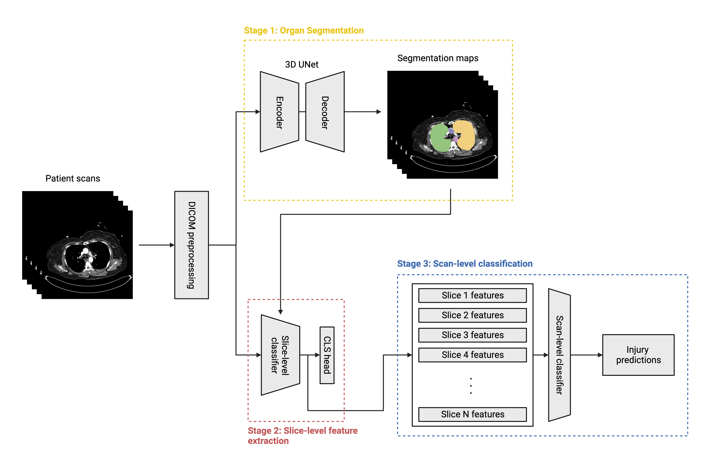

# RSNA Abdominal Trauma Detection Challenge

# Introduction
This repository contains the training and inference code for my solution to the [RSNA Abdominal Trauma Detection challenge](https://www.kaggle.com/competitions/rsna-2023-abdominal-trauma-detection/overview), which placed 23rd on the public leaderboard and 24th on the private leaderboard. My solution consists of three stages: 

1. Organ segmentation
2. Slice-level feature extraction
3. Scan-level classification

An overview of the solution is shown in the figure below. The full submission notebook is also included for reference.



# Organ Segmentation
The segmentation stage aims to extract bounds for relevant organs in the patient scans (bowel, liver, kidney, and spleen), which we can then leverage in downstream classification models. My choice of segmentator architecture is a 3D UNet model with an EfficientNet backbone and input dimensions of $128 \times 224 \times 224$, which I construct by inflating the modules of a 2D UNet model. I train the model on the subset of patients with available segmentation labels, and use it to predict segmentation probability maps for the full set of patients. The commands below are used to execute the training and inference scripts, respectively.

```
# Training
python3 src/scripts/segmentation/train.py --config=configs/segmentation/tf_efficientnetv2_s_128_224_224.yaml

# Inference
python3 src/scripts/segmentation/train.py --config=configs/segmentation/inference.yaml
```

# Slice-level feature extraction
The second stage seeks to extract slice-level features from each patient scan, which are then fed to a scan-level classifier in the third stage. For this stage, I train segmentation-informed classification models on slice-level labels, which are derived by multiplying the scan-level labels by the organ visibilities for a given slice (for instance, a patient with a high-grade liver injury will have positive slice-level liver injury labels only on the slices where the liver is visible). I fine-tune three families of slice-level classifiers: EfficientNet, ConvNeXt, and MaxViT. During inference, I extract the $k$-dimensional features output by the last hidden layer of each model and save them for use in the third stage. The commands below are used to execute the training and inference scripts, respectively.

```
# Training
python3 src/scripts/slice_classification/train.py --config=configs/slice_classification/tf_efficientnetv2_s_384.yaml

# Inference
python3 src/scripts/slice_classification/infer.py --config=configs/slice_classification/inference.yaml
```

# Scan-level classification
In the third and final stage, I concatenate the slice-level feature maps from the second stage into scan-level sequences. Thus, if a scan has $n$ slices with features of dimension $k$, the scan-level sequence has dimensions of $n \times k$. The sequences are then padded and resized to standard dimensions of $128 \times 512$, and used to train a recurrent neural network for the task of predicting scan-level injury labels. My implementation uses a gated recurrent unit augmented with a self-attention module. The commands below are used to execute the training and evaluation scripts, respectively.

```
# Training
python3 src/scripts/slice_classification/train.py --config=configs/scan_classification/lstm_512_128.yaml

# Evaluation
python3 src/scripts/slice_classification/infer.py --config=configs/scan_classification/evaluation.yaml
```
